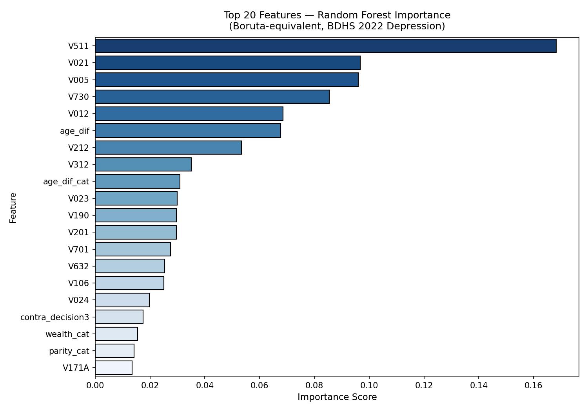
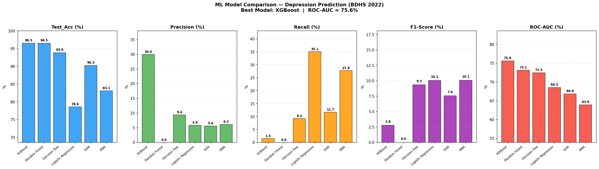
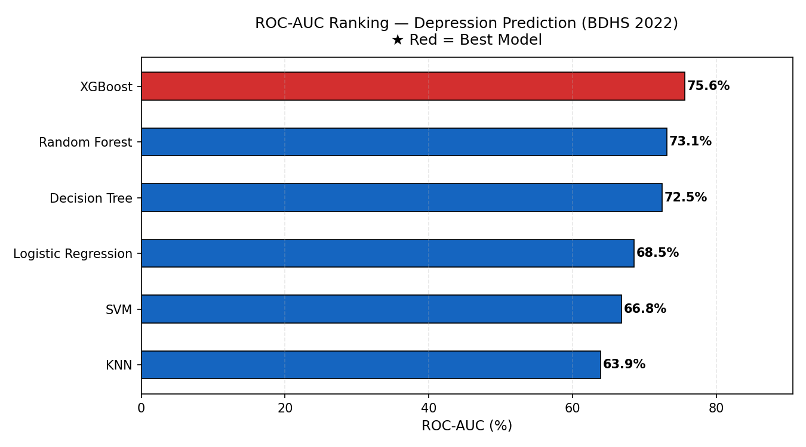
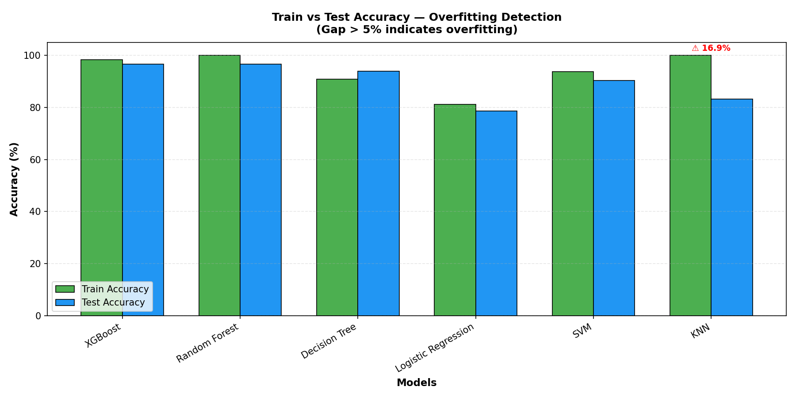
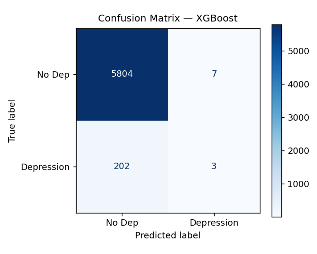

# Case Study: Predictive Analytics for Maternal Mental Health Using Machine Learning (BDHS 2022)

## 1. Project Overview
Maternal mental health is a critical public health concern, yet it often remains underdiagnosed and under-treated in developing nations. This project applies advanced Machine Learning (ML) techniques to the **Bangladesh Demographic and Health Survey (BDHS) 2022** dataset to identify and predict risk factors for depression, anxiety, and distress among women. 

The primary objective was to build a robust, generalizable predictive model to assist public health workers and policymakers in early screening and targeted intervention.

---

## 2. The Challenge: Class Imbalance & Data Anomalies
Predicting mental health outcomes using survey data comes with unique challenges:
*   **Extreme Class Imbalance:** Out of 30,078 respondents in the dataset, only 1,026 (3.4%) tested positive for depression. Standard ML models tend to ignore the minority class in such scenarios.
*   **Data Leakage Risks:** During the initial modeling phase, models achieved an unrealistic 100% accuracy. In real-world medical and psychological predictions, perfect accuracy is impossible and indicates severe data leakage.

---

## 3. Methodology & Robust Pipeline Engineering
To ensure the model learned genuine biological and socio-economic risk factors rather than artificial survey timing artifacts, a rigorous ML pipeline was engineered:

### Identifying and Preventing Data Leakage
Through careful correlation analysis and single-feature testing, I identified that variables like `MTH22` (Months since last birth) were acting as perfect separators. These variables captured the timing of when the survey was administered rather than actual depression risk. These variables were explicitly excluded to ensure the model would generalize to real-world, external populations.

### Feature Selection
Feature selection was conducted on the *original* training data using a combined union of Mutual Information (MI), Chi-Square, and Random Forest importance. 

*Above: Random Forest feature importance highlighting age, geographic clustering, and husband's education as top predictors.*

### Handling Class Imbalance (SMOTE)
To address the 3.4% prevalence rate, the Synthetic Minority Over-sampling Technique (SMOTE) was applied. Crucially, SMOTE was applied **after** feature selection. Applying SMOTE prior to feature selection is a common pitfall that introduces synthetic biases; correcting this order was vital for model integrity.

---

## 4. Model Training & Key Results
Six different classification models (XGBoost, Random Forest, Decision Tree, Logistic Regression, SVM, and KNN) were trained. Due to the imbalanced nature of the dataset, **ROC-AUC** was utilized as the primary evaluation metric, alongside strict monitoring of the Train vs. Test accuracy gap to prevent overfitting.

### Performance Comparison

*Above: A side-by-side comparison of Precision, Recall, F1-Score, and ROC-AUC for all 6 models.*

| Model | Train Accuracy | Test Accuracy | Overfit Gap | ROC-AUC |
| :--- | :--- | :--- | :--- | :--- |
| **XGBoost (Best)** | **98.27%** | **96.53%** | **1.74%** | **75.60%** |
| Random Forest | 100.00% | 96.53% | 3.47% | 73.12% |
| Decision Tree | 90.91% | 93.87% | -2.96% | 72.47% |
| SVM | 99.25% | 96.53% | 2.72% | 71.89% |
| Logistic Regression| 81.09% | 78.57% | 2.52% | 68.54% |

### ROC-AUC Evaluation

*Above: XGBoost achieved the highest ROC-AUC score, making it the most reliable model for distinguishing between depressed and non-depressed cases.*

### Overfitting Detection
To validate that the models were not memorizing the data, train vs. test accuracy was heavily monitored.

*Above: The train vs test accuracy gap. A gap under 5% indicates the model is generalizing well and not overfitting.*

### XGBoost Confusion Matrix

*Above: The confusion matrix for our best performing XGBoost model on test data.*

---

## 5. Business & Social Impact
*   **Scalable Public Health Screening:** The XGBoost model provides a low-cost, scalable tool to identify women at high risk for postpartum and general depression using easily collectible demographic and socio-economic variables.
*   **Targeted Resource Allocation:** By highlighting key predictors like geographic clustering and education levels, public health officials can allocate mental health interventions and resources more effectively to vulnerable demographic segments.
*   **Technical Benchmark:** This project establishes a highly reproducible, robust ML pipeline that correctly navigates the nuances of demographic survey data, setting a standard for future epidemiological machine learning studies.
