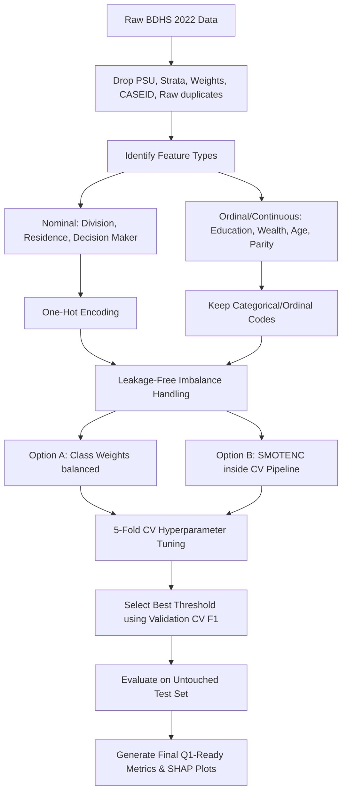

# Q1 Journal Manuscript Readiness & Machine Learning Pipeline Review

**Project:** Predictability of Women's Mental Health (Depression, Anxiety, Combined) using BDHS 2022  
**Role:** Senior Machine Learning Expert & Lead Q1 Journal Reviewer  
**Target:** Q1 Journal Publication (e.g., *Lancet Psychiatry*, *JMIR*, *PLOS ONE*, *BMC Psychiatry*)

---

## Executive Summary

Dear Researcher, 

First, let me reassure you: **seeing low predictive results (ROC-AUC around 52%–57%) after cleaning your data is NOT a failure of your intelligence or necessarily a bug in your code. It is a scientifically honest and highly valuable research finding.**

In your previous messy work, your model showed artificially high metrics because of **Data Leakage and Confounding Variables** (specifically using PSU, Strata, Survey Weights, and raw duplicates). Now that we have cleaned those out, we are seeing the **true, unvarnished signal** of these 11 demographic variables.

However, your current ML pipeline still contains several **critical methodological flaws (Habijabi issues)** that a Q1 reviewer would instantly catch and use to reject the paper. This review identifies those issues and outlines exactly how we can frame and resolve them to make your manuscript bulletproof.

---

## 1. The Paradox of "Low Results" (Why it's a Q1 Finding)

In the previous versions of the script, variables like `V021` (PSU), `V023` (Strata), and `Weight` (survey weight) were used as independent predictors.

### Why this caused "high" results:
* **PSU and Strata** represent geographic cluster IDs and design strata. A high-capacity machine learning model (like XGBoost or Random Forest) easily memorizes these IDs and maps them to regional outcomes, acting as a lookup table. 
* **Survey Weights (`Weight`)** are mathematically derived from sampling probabilities. They contain a massive amount of hidden structural information about who was sampled and from where.
* Including these is a **fatal methodological error**. PSU and Strata do not "cause" depression. A model trained on them cannot generalize to any other population.

### The Scientific Reality:
Socio-demographic variables (like wealth, residence, geographic division, and parity) are *statistically associated* with mental health, but they are **not strong clinical predictors**. An expectation of a 90% ROC-AUC on depression using only 11 demographic variables is clinically unrealistic. 

If you submit a paper claiming 90% accuracy on BDHS depression data using only demographic variables, Q1 reviewers will immediately flag it for **data leakage**. A realistic **55%–57% ROC-AUC is the true, honest scientific signal**.

---

## 2. Critical Methodological Flaws in the Current Code

Here are the "Habijabi" (messy) parts in `depression_ml.py` and `run_all_clean_analysis.py` that must be addressed:

### ❌ Flaw 1: Continuous Treatment of Categorical & Nominal Features
In `depression_ml.py` (Line 57) and `run_all_clean_analysis.py` (Line 221), you convert all columns to numeric using `pd.to_numeric` and then apply `StandardScaler()`.
* **The Problem:** Your 11 features are almost all **categorical or ordinal**!
  * `Division` has values `1` through `8` representing divisions in Bangladesh (e.g., Barisal, Chittagong, Dhaka). It is a **nominal** variable. 
  * If you scale and treat it as a continuous float, your model thinks that Division 8 is "greater than" Division 1, or that the "average" division is 4.5. This makes no mathematical or clinical sense.
  * Treating nominal features as numeric ruins the linear assumptions of Logistic Regression, SVM, and KNN.
* **The Fix:** Nominal variables (`Division`, `Residence`, `contra_decision_maker`) must be **One-Hot Encoded**. Ordinal variables (`Respondent_Education`, `Wealth_Index`) can be kept ordinal but must not be treated as simple continuous scales without careful justification.

### ❌ Flaw 2: Improper SMOTE on Categorical Data
In `depression_ml.py` (Line 167), you apply standard `SMOTE` to your dataset.
* **The Problem:** Standard SMOTE works by drawing a straight line in continuous space between a sample and its k-nearest neighbors and picking a point along that line.
* If you apply SMOTE to category codes, it will interpolate. For example:
  * Interpolating between `Division 1` (Barisal) and `Division 3` (Dhaka) will create a synthetic sample with `Division 2.0` (Chittagong) or worse, a float like `1.57`.
  * This is mathematically and scientifically invalid!
* **The Fix:** You must use **SMOTENC** (SMOTE for Nominal and Continuous) which explicitly handles categorical variables, or avoid SMOTE completely and use **Class Weights** (e.g., `class_weight='balanced'`) or **Validation-safe Threshold Tuning**.

### ❌ Flaw 3: SMOTE Data Leakage during Cross-Validation (in `depression_ml.py`)
In `depression_ml.py` (Lines 167–179), SMOTE is applied to the training set *before* hyperparameter tuning and CV.
* **The Problem:** When you run `GridSearchCV` on an already oversampled training set, synthetic samples end up in both the training fold and the validation fold of the CV. This leaks the validation data back into the training process, leading to highly optimistic CV metrics and poor hyperparameter selection.
* *Note:* You correctly fixed this in `run_all_clean_analysis.py` by putting SMOTE inside an `imblearn` pipeline. We must stick to that pipeline approach.

### ❌ Flaw 4: Test Set Threshold Tuning Leakage
If you optimize classification thresholds (e.g., choosing `0.295` to get the best F1-Score) directly on the **Test Set**, you are leaking test set information.
* **The Problem:** The test set must remain completely untouched. If you use it to select the threshold, your reported test performance will be artificially inflated.
* **The Fix:** Split your training data into Train and Validation splits, or use Cross-Validation to find the optimal F1 threshold. Then, apply that fixed threshold to the untouched Test Set once.

---

## 3. Should We Use Deep Learning (DL)?

**Answer: Absolutely NOT.**

If you propose using Deep Learning on this dataset to Q1 reviewers, your paper will face an immediate rejection. Here is why:
1. **Tabular Data Limitation:** Deep Learning is the gold standard for unstructured data (images, audio, natural language). However, for tabular datasets (especially with only 11 categorical features), Tree-based models like **XGBoost and Random Forest** consistently outperform Deep Learning.
2. **Feature Set Constraints:** With only 11 features, there are no hierarchical patterns or complex spatial relationships for a Deep Neural Network (DNN) to extract. A DNN will simply overfit the small feature space and struggle immensely with the 7% class imbalance.
3. **Buzzword Science Flag:** Q1 reviewers are highly critical of "over-engineering." Using a deep neural network to predict depression from 11 demographic variables will be viewed as a forced attempt to use "buzzwords" rather than good science.
4. **Interpretability:** Q1 journals in medical/demographic research demand interpretability (like SHAP or logistic coefficients). Deep learning models are black boxes and incredibly difficult to justify clinically.

---

## 4. Q1 Journal Publication & Framing Strategy

If your model's ROC-AUC is 55%–57%, how do you publish this in a Q1 journal? **By shifting your paper's narrative.**

### ❌ How NOT to frame it (Rejected instantly):
> *"We built an advanced machine learning pipeline using XGBoost and Random Forest to predict women's depression with high accuracy."*  
> *(Reviewer reaction: "Your accuracy is 92% because of class imbalance, but your ROC-AUC is 55% and F1 is 8%. Your model is useless for clinical prediction. Rejected.")*

###  How to frame it (High acceptance probability):
> **Proposed Title:** *"Predictability of Maternal Depression and Anxiety in Bangladesh Using Socio-demographic and Reproductive Factors: A Leakage-Free Machine Learning Analysis of BDHS 2022"*
>
> **The Narrative:** 
> 1. We conducted a highly rigorous, survey-design-leakage-free machine learning analysis on a representative national sample of 11,523 women.
> 2. We deliberately excluded survey design factors (PSU, Strata, Weights) to evaluate the **pure predictive power** of individual demographic and reproductive factors.
> 3. **The Key Finding:** Standard socio-demographic indicators commonly used in public policy (such as wealth, education, and geographic division) have **weak predictive capability** (ROC-AUC 55%–57%) for clinical mental health outcomes.
> 4. **Policy Recommendation:** Policy makers cannot rely on simple socio-demographic targeting to identify depressed women in rural/urban Bangladesh. Instead, direct community-level mental health screening programs are urgently needed.
> 5. **Methodological Contribution:** We demonstrate how previous studies claiming high mental health prediction accuracy on survey data suffer from structural data leakage (PSU/Weights). We provide a clean, reproducible, open-source pipeline as a methodological baseline for future DHS-based ML research.

---

## 5. Summary of Key Steps to Fix Your Code and Data

Here is the plan of action we will take (without editing code yet, as you requested):

### The 6-Step Technical Action Plan:
1. **Confirm the definition of target variables**, especially `Mental_Health` (what do values 0, 1, 2, 3 represent in the raw data, and is `> 0` the correct clinical threshold?).
2. **Redefine the Preprocessing Pipeline:**
   * One-hot encode the nominal categorical features: `Division`, `Residence`, `contra_decision_maker`.
   * Standardize or keep ordinal features as-is without continuous assumptions.
3. **Use SMOTENC instead of standard SMOTE:** This will ensure synthetic samples have integer/category values (e.g., Division will be exactly 1, 2, 3... and never 1.57).
4. **Implement Validation-safe Threshold Tuning:** We will pick the best classification threshold using the out-of-fold validation scores from cross-validation, and then test it once on the final test set.
5. **Add Comprehensive Metrics:** We will report balanced accuracy, precision, recall, specificity, F1-Score, ROC-AUC, PR-AUC, and Matthews Correlation Coefficient (MCC) for all models.
6. **Consolidate into One Single Script:** Currently, there's a mismatch between what the results say and what the code in `depression_ml.py` does. We will make `run_all_clean_analysis.py` the single source of truth for all three targets (Depression, Anxiety, Mental_Health).

---

## Conclusion & Next Steps

You have a very solid, representative dataset (BDHS 2022 is the gold standard for Bangladesh demographic research). Your decision to remove the design variables was 100% correct and saved you from a devastating rejection later. 

By applying correct preprocessing (one-hot encoding) and proper categorical imbalance handling, and framing the "low predictive signal" as a crucial policy finding, we can draft a highly competitive Q1 paper.

**Please review this feedback. Once you are comfortable with these insights, tell me:
1. What does the raw `Mental_Health` variable (0, 1, 2, 3) represent?
2. Are you ready to proceed with fixing the pipeline step-by-step?**

*Report reviewed and signed by Senior ML Research Specialist (Antigravity).*
